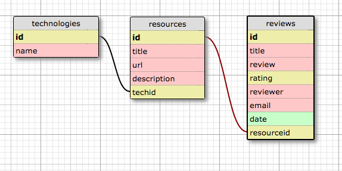

# Programmer Resource Reviews
Version 0.0.0: September 21, 2016

by [Karen Freeman-Smith](https://github.com/karenfreemansmith) and [Sheena Nickerson](https://github.com/sheenanick)

## Description
A program to add links to resources and allow users to leave reviews/ratings.

### Specifications
#### User Stories:
* As a user, I want to see a list of all links that have been entered.
* As a user, I want to be able to select a link and see its details.
* As a user, I want to be able to click on a specific programming language/technology to see links for learning that technology. For instance, maybe I only want to see links that belong to the Spark framework.
* As a user, I want to be able to add links I have seen with relevant details.
* As an admin, I want to be able to update any/all links to add relevant information, or to correct errors. (Important: Don't worry about user authentication, simply allow anyone to delete/update anything for the time being).
* As an admin, I want to be able to delete a links if it doesn't contain accurate information, or isn't relevant.
* As a user, I want to leave comments and explanation with my review including the date submitted.
* As a user, I want to leave some sort of quantitative rating measurement with my review.
* As a user, I want to see all reviews for a specific links I'm considering looking at.
* As a user, I want to sort links by any ratings reviewers left.
* As an admin or user, I want to be able to update a review if there are mistakes or inaccuracies. (Again, don't worry about user authentication, simply allow anyone to delete/update anything).
* As an admin, I want to be able to delete any reviews that aren't helpful or appropriate.
* As a user, I want to see how many reviews, or average rating a link has.  
* As a user, I want to be able to submit a form to search for a link by name, or by another property. (Hint: Use a SQL query).
* As an (indecisive) user, I may want the equivalent of an "I'm feelin' lucky" button to show me a link at random.
* As a user, I want to see a professional, easy-to-navigate user interface.

#### Database Schema

#### Technical Specifications
| Behavior                             | Input                                            | Output                                           |
|--------------------------------------|--------------------------------------------------|--------------------------------------------------|
| Store technology name                | 'Java'                                           | 'Java'                                           |
| Store link title                     | 'Oracle Documentation'                           | 'Oracle Documentation'                           |
| Store link url                       | https://docs.oracle.com/javase/7/docs/api/       | https://docs.oracle.com/javase/7/docs/api/       |
| Store link description               | 'everything you never wanted to know about Java' | 'everything you never wanted to know about Java' |
| Connects link to technology category | 'Oracle Documentation'                           | 'Java'                                           |
| Lists links by technology            | 'Java'                                           | 'Oracle Documentation'                           |
| Update links                         | https://docs.oracle.com/javase/8/docs/api/       | https://docs.oracle.com/javase/8/docs/api/       |
| Delete links                         | 'Starbucks Java Beans'                           | null                                             |

## Setup/Installation
* Clone directory
* Type 'gradle run' inside the directory
* Navigate to 'http://localhost:5467'

## Support & Contact
For questions, concerns, or suggestions please email karenfreemansmith@gmail.com

## Known Issues
* N/A

## Technologies Used
Java, JUnit, Spark, Gradle, PostgreSQL

## Legal
*Licensed under the GNU General Public License v3.0*

Copyright (c) 2016 Copyright _Karen Freeman-Smith & Sheena Nickerson_ All Rights Reserved.
